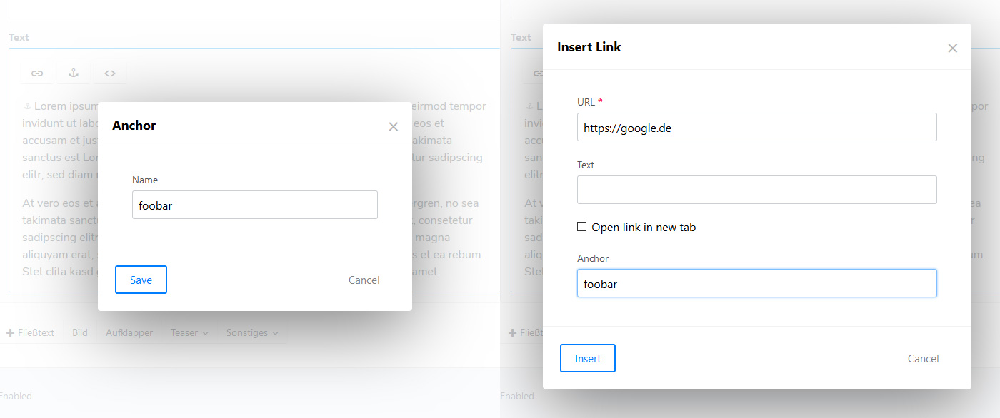

# Anchors for Redactor in Craft 3



Add anchor functionality for Reactor in Craft CMS 3


## Installation

1. Run Composer in your project folder:

```
composer require utakka/redactor-anchors
```

2. Open your Craft Control Panel, navigate to Plugins and click 'Install' for Redactor Anchors.

3. Add `redactoranchors` to plugins array in your Redactor config file (located in config/redactor/)


## Changelog

2019-06-17: Initial release
